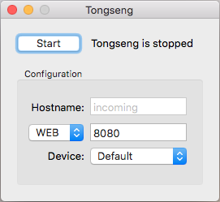

## Nodebox TUIO Touch

Demo templates for creating touch experiments with Nodebox.live using  [TUIO](https://www.tuio.org/).
 
These examples receive the touch signals via web sockets (port 8080).   
You can use these examples with [TongSeng](https://github.com/fajran/tongseng) to prototype multitouch experiments on the trackpad / magic pad of your macbook.

### Usage

1. Disable multitouch gestures on your mac (Check out the trackpad settings)

2. Download the TongSeng app [here](https://github.com/fajran/tongseng/releases/download/0.7/Tongseng-0.7.zip).

3. Switch Tongseng to `WEB` mode and press `Start`

4. Open one of the examples and use your fingers

### [Touch Nodes](01_touch_nodes)

Forward each touch move event to a dedicated nodebox node.

### [Touch Zones](02_touch_zones)

Create dedicated zones to capture touch event

### [Touch Points](03_touch_points)

Sends a collection of points to nodebox, one for each finger.

### License

Licensed under the GPL license.  
The templates are using a custom rolled version of [Tuio.js](https://github.com/nomve/Tuio.js).
